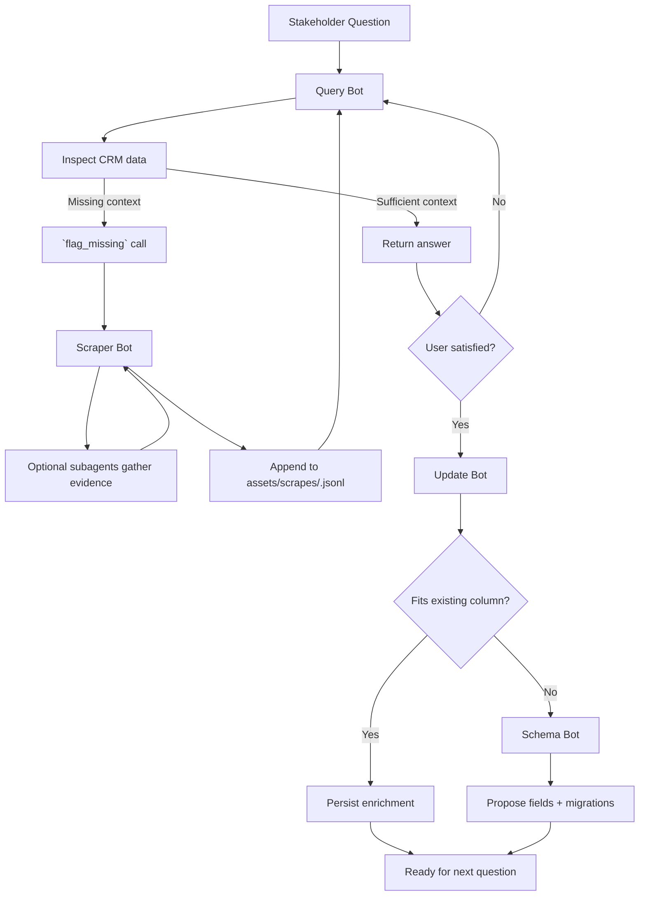

# Self-Enriching Business Intelligence System

## Purpose
This system turns a static customer relationship management (CRM) dataset into a living knowledge asset. During development it operates entirely against CSV exports, so teams can iterate without provisioning a warehouse. Whenever stakeholders ask questions about the business, the platform uses a coordinated set of GPT-5-powered agents to answer, enrich, and evolve the underlying data. The result is a self-updating data estate that closes gaps as they are discovered.

## Core Capabilities
1. **Answer existing questions** &mdash; The query bot reads row-level records from the CSV-backed data store, applies GPT-5 Enterprise for reasoning, and uses the GPT-5 Codex Pro interpreter to compose SQL or lightweight code when it needs deeper analysis.
2. **Enrich missing context** &mdash; When the necessary facts are absent, the query bot fires a `flag_missing` function call that wakes a scraper ensemble. The scraper bot and its optional subagents call the OpenAI Responses API web-search tool, consolidate findings into `assets/scrapes/<ticket>.jsonl`, and return a ranked list of candidate facts to the query bot.
3. **Improve the schema** &mdash; After an answer is accepted, the update bot reconciles new attributes with the CRM. If no column can store a discovered value, it escalates to the schema bot, which emits column specs plus Codex-authored migrations under `schema/`, ensuring future queries are tractable.

## Agent Architecture
- **Query Bot (`src/agents/query_agent.py`)**: First responder for user questions. It operates in short loops: attempt to answer from current data; if the response is incomplete, trigger `flag_missing`; ingest scraper returns; retry with the enriched dataset until confident or exhausted. The bot runs against the CSV executor (`src/integrations/csv_sql_executor.py`) by default, keeping the stack database-free during development.
- **Scraper Bot (`src/agents/scraper_agent.py`)**: Converts the `flag_missing` call into a research plan. It invokes the configured search provider (OpenAI Responses API by default), normalizes results, then appends structured evidence to `assets/scrapes/<ticket>.jsonl`. Each entry carries provenance metadata so downstream agents can assess confidence.
- **Update Bot (`src/agents/update_agent.py`)**: Activated once the user signs off on an answer. It reconciles enriched attributes against CRM records, applies deterministic updates, and records rationale for each change. When it detects that a value does not map cleanly to existing fields, it raises a schema request.
- **Schema Bot (`src/agents/schema_agent.py`)**: Receives the original query, the final answer, enrichment artifacts, and the update bot's rationale. It recommends new columns (name, data type, constraints, default handling) and, where viable, uses Codex to draft SQL migrations so the schema catalog in `schema/` stays in sync.

## Interaction Diagram

## End-to-End Flow
1. A user issues a business question through the query bot.
2. The query bot inspects the tracked fields, runs Codex-powered SQL, and returns an answer when sufficient context exists.
3. If the answer is incomplete, the query bot calls `flag_missing` to launch the scraper bot.
4. The scraper bot (and optional subagents) executes searches via the Responses API web-search tool, scrapes sources, and appends vetted findings to `assets/scrapes/<ticket>.jsonl`.
5. The query bot rehydrates the new evidence, reruns SQL or light transformations, and either answers the question or repeats steps 3–5 until confident.
6. Once the user confirms the answer, the update bot synchronizes the enriched attributes with CRM records.
7. When the update bot detects a schema gap, it forwards the conversation, data, and rationale to the schema bot.
8. The schema bot proposes new fields and migrations; once applied, they expand the schema catalog so future questions resolve more quickly.

## Why It Matters
- Ensures analytics keep pace with evolving business questions without manual backlog grooming.
- Captures research context alongside data, improving auditability and trust.
- Turns every stakeholder query into an opportunity to raise data completeness and model relevance.

## Operational Setup
- Set `CSV_DATA_PATH` in `.env` to point at the latest export; use `python -m src.integrations.csv_dataset <path>` to validate column coverage before each run.
- Set `OPENAI_API_KEY` in `.env` (or the variable referenced by `search.api_key_env`) to enable the web-search tool.
- Configure agent model overrides via `configs/{environment}.yaml` (`model_id`, `codex_id`, and `search.model_id`).

## Next Steps for Implementation
- Document agent token budgets, rate limits, and safety guidance in `docs/agents/` to align operations.
- Validate end-to-end behaviour by running `python -m src.core.runner --profile dev` and `make ci` before deployment.
